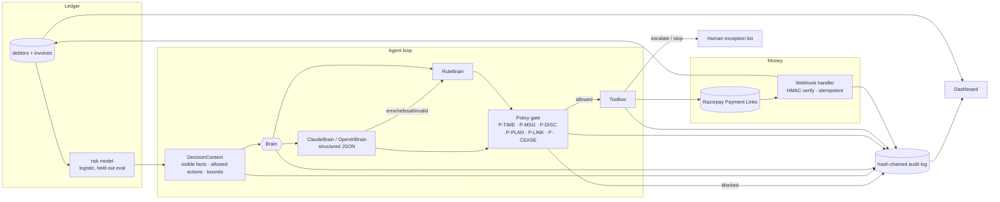

# Architecture

## Design decisions

**One gate, no exceptions.** Every brain, baseline and fault injector goes through
`Toolbox.execute`, which calls `Policy.evaluate` on the actual parameters after defaults are filled
in. The pre-filtered allowed-actions list is a courtesy to save the model a wasted turn, not the
enforcement point. Even a jailbroken prompt cannot get a 15% discount or a threat out of the system.

**The LLM does only what an LLM can.** Reading "20 cartons were short-shipped, not paying till
corrected" and recognising a dispute. Drafting a message that references real history. Choosing
between a plan and a discount. It does not compute amounts, call Razorpay, or decide whether the
merchant may discount at all.

**Deterministic fallback, not a retry storm.** When the LLM is unreachable, slow, refuses, returns
malformed JSON or picks a blocked action, the rules brain answers that one decision and the audit
records `brain_fallback` with the cause. If the client cannot be constructed at all, the whole run
degrades to rules and records `brain_unavailable`, so a report never overstates the LLM.

**Provider-agnostic by construction.** `ClaudeBrain` and `OpenAIBrain` share the prompt, schema,
allowed-action list and return type. Each owns only its SDK's quirks: raw JSON schema versus Pydantic
model, `cache_control` versus automatic caching with a cache key, `stop_reason == "refusal"` versus
`message.refusal`, and OpenAI's `reasoning_effort` which non-reasoning models reject. The simulated
outage is a neutral exception type, so the fallback path cannot depend on one vendor.

**Stopping rules are policy, not vibes.** A dispute, hardship claim, cease request or four unanswered
contacts each map to a terminal state with a reason string that lands on the exception list sorted by
amount. The job is to convert what it can and hand over the rest with context, not to grind.

**Paise, not floats.** Integer paise everywhere, matching Razorpay. Rupee formatting is for humans.

**Same code path for fake and real.** `FakeRazorpay` implements the documented `payment_links` entity
shape and signs webhook bodies the way Razorpay does, so signature checking, link-to-invoice lookup
and idempotency are exercised on every simulated payment. Switching to test mode is an env var.

**Measured against two baselines.** Do-nothing gives the organic floor. Naive reminders is what SMEs
actually do, run with the policy in record-only mode so the 934 conduct violations it would commit
are visible.

**Honest risk metrics.** Labels come from the do-nothing run, the split is by debtor hash so nobody
leaks between train and holdout, and the report prints TP/FP/FN/TN at two thresholds rather than one
flattering number.

## One decision, end to end

1. `_queue` picks invoices due today or carrying an unprocessed reply, ordered by risk times
   outstanding.
2. `DecisionContext.for_llm()` serialises visible fields only (never the archetype), the last six
   timeline events, the new inbound message, the stop reason, the allowed-action map with block
   reasons, and the bounds.
3. The brain returns `Decision(action, params, message, rationale, reply_intent, source)`.
4. The runner applies `reply_intent` to invoice state before the gate, so a cease request blocks the
   very action proposed alongside it.
5. `Toolbox.execute` fills defaults, evaluates policy, records `policy_check`, runs the handler.
6. Payments arrive later as signed webhooks.

## Next

- Per-debtor negotiation memory across invoices.
- A/B the LLM's drafted messages against templates on real reply rates.
- Razorpay Smart Collect virtual accounts so NEFT payments reconcile automatically.
